# 85.7% of one thermal clip's "empty" frames had people in them

*2026-10-01 · Milestone: Trusted ground · Draft for the owner to edit*

We are building a person detector for search and rescue from drone footage
with few labels. Before training anything, we checked what the work would
stand on. In a public dataset, both existing pairings of the RGB and thermal
frames were wrong. The test split would have leaked. Our first scoring code
flattered itself. And one thermal clip's "empty" frames were mostly not empty:
of the 35 frames a reviewer was sure about, 30 showed people with no box,
85.7% ([#49 handoff][i49-handoff]). No model has been trained yet. That is the
point: these faults would have looked like model results.

## The result

- **Pairing.** Two sets of pairs existed, 16,459 and 8,759 ([#2][i2]). The
  first paired by position and included 1,620 pairs from a flight whose two
  cameras run at different rates. The second used a parser that read only 5 or
  6 digit frame numbers and collapsed seven clip pairs to one pair each
  ([pairing review][pairing-review]). The fixed rule gives 14,834 pairs from
  17 clip pairs, 5,739 labelled in both cameras ([pairing review][pairing-review]).
  We checked them by camera motion and by eye.
- **Split.** The old split put 0 labelled pairs in test ([#2 handoff][i2-handoff])
  and assigned whole clips at random, so one site and day could straddle
  splits ([#3][i3]). Now each of four site-days is held out in turn. A check
  that reads the manifests back found no leak, after a reviewer showed its
  first version passed corrupted records ([#3 handoff][i3-handoff]).
- **Scoring.** The first version scored too well. A 6 x 6 person found, and a
  20 x 20 false alarm ranked above it, gave recall 1.0 where the right answer
  is 0.0 ([evaluation review][metric-review]). The lead's own hand-worked case
  missed it; two reviews caught it. The tests now catch all 18 deliberate
  changes to the code ([#4 handoff][i4-handoff]).
- **Labels.** The clip above is why the folds now treat its empty-label
  thermal frames as unlabelled ([#49 handoff][i49-handoff]).

There is no `ap_iou25` or `ap_iou50` here, because there is no model result.
The scorer reports both, side by side, for the first runs.

## What it means for search and rescue

A detector is only useful to a team if its score says what will happen at a
site it has never seen. A leaked split, a misaligned pair or a generous scorer
each break that promise quietly. The labels matter most: a person the labels
call background is a false alarm to the scorer, and a lesson in ignoring
people to the model. This milestone shows nothing about detection accuracy.

## What comes next

The first experiment: how far a frozen foundation model gets with 1%, 5%, 10%
and 100% of the labels, per camera, on the four folds
([milestone note](../milestones/trusted-ground.md)). It is the bar every later
technique must beat.

## The detail

The step-by-step account, with the commands and the mistakes, is in the
[follow-along guide](../guide/README.md): chapters
[2, pairing](../guide/02-pairing-the-two-cameras.md),
[3, scoring](../guide/03-scoring-tiny-people.md) and
[4, splitting](../guide/04-splitting-by-site-day.md).

[i2]: https://github.com/graylayer-labs/ssl-aerial-person-detection/issues/2
[i3]: https://github.com/graylayer-labs/ssl-aerial-person-detection/issues/3
[i2-handoff]: https://github.com/graylayer-labs/ssl-aerial-person-detection/issues/2#issuecomment-5893694772
[i3-handoff]: https://github.com/graylayer-labs/ssl-aerial-person-detection/issues/3#issuecomment-5936845727
[i4-handoff]: https://github.com/graylayer-labs/ssl-aerial-person-detection/issues/4#issuecomment-5892972875
[i49-handoff]: https://github.com/graylayer-labs/ssl-aerial-person-detection/issues/49#issuecomment-5939538286
[pairing-review]: ../wisard-pairing-review.md
[metric-review]: ../evaluation-metric-review.md
