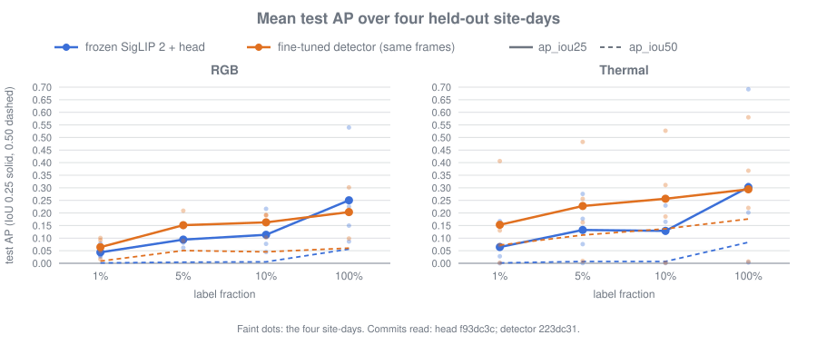

# Milestone 2: Off-the-shelf bar

Written 2026-10-04 by the lead. The milestone ran from 2026-10-02 to
2026-10-04.

**One sentence:** a frozen foundation model was measured with few labels, and
an ordinary fine-tuned detector beat it.

## What we set out to do

Set the bar every later technique has to beat: how well can people be found in
drone footage, per camera, with 1%, 5%, 10% and 100% of the training labels,
using a pretrained foundation model that has never seen drone footage? The
model is SigLIP 2, kept frozen, with a small detection head trained on its
features. The epic also asked two questions any reader would ask next. Does
the frozen model beat the ordinary approach, an off-the-shelf detector
fine-tuned on the same labels? And do thermal frames, nothing like the
photographs SigLIP 2 learned from, need to be fed in differently?

## The result

Mean test `ap_iou25` / `ap_iou50` over the four folds. Each fold tests on one
site-day never seen in training. One seed per run.

| Labels | RGB, frozen head | RGB, fine-tuned detector | Thermal, frozen head | Thermal, fine-tuned detector |
|---|---|---|---|---|
| 1% | 0.044 / 0.001 | 0.064 / 0.009 | 0.065 / 0.001 | 0.153 / 0.072 |
| 5% | 0.094 / 0.004 | 0.152 / 0.051 | 0.132 / 0.007 | 0.228 / 0.112 |
| 10% | 0.113 / 0.006 | 0.163 / 0.046 | 0.129 / 0.007 | 0.256 / 0.137 |
| 100% | 0.250 / 0.056 | 0.204 / 0.060 | 0.302 / 0.083 | 0.294 / 0.176 |

Both methods see the same frames at the same input size (672×384 RGB,
560×448 thermal) and are scored by the same code. Per-fold tables:
[`detection-head-results.md`](../detection-head-results.md) and
[`supervised-baseline-results.md`](../supervised-baseline-results.md).

## What we found

| Question | Answer | Evidence |
|---|---|---|
| How far does a frozen foundation model get? | Mean `ap_iou25` 0.04 to 0.07 at 1% of labels, 0.25 to 0.30 at 100%. Boxes are loose: `ap_iou50` stays under 0.09. People under 16 pixels are not found in RGB. | [#66](https://github.com/graylayer-labs/ssl-aerial-person-detection/issues/66) |
| Does it beat an ordinary fine-tuned detector? | No. A COCO-pretrained Faster R-CNN (MobileNetV3) is ahead at 1%, 5% and 10% on both cameras, in 22 of 24 fold cells, and level at 100%. Its boxes are tighter everywhere. | [#67](https://github.com/graylayer-labs/ssl-aerial-person-detection/issues/67) |
| Does thermal need its own input handling? | No. Copying the grey channel is as good as a learned input stem (−0.009 and +0.007 against a matched control). Histogram equalisation hurts (−0.050 at 10%, −0.137 at 100%). | [#68](https://github.com/graylayer-labs/ssl-aerial-person-detection/issues/68) |
| Is the frozen head under-trained at few labels? | No. It peaks within 25 to 150 steps and overfits; a finer choice of step moves its mean by at most 0.01. | [#91](https://github.com/graylayer-labs/ssl-aerial-person-detection/issues/91) |
| What limits both methods most? | Resolution. The same detector on the full 4K frame scored 0.779 on one site-day, against 0.213 at the shared input size. One run. | [#67](https://github.com/graylayer-labs/ssl-aerial-person-detection/issues/67) |

## The bar for what comes next

The fine-tuned detector at the shared input size is the bar, not the frozen
head. Any later technique, at a given label fraction and camera, has to beat
the detector's row above on the same folds. The frozen head stays in the
tables as the starting point.

## What four site-days let us claim

WiSARD has four labelled site-days, so every result is a mean over four
folds, and here one seed per run. That supports some claims and not others.

- **Firm:** the direction of the head-versus-detector comparison at 1% to
  10%. It goes the same way in all six camera-and-fraction cells and in 22 of
  24 folds. So does the harm from equalisation, in 3 of 4 folds at each
  fraction.
- **Not firm:** any difference smaller than the spread over folds, which is
  often as large as the mean. That covers 100% of labels (head and detector
  level), the learned stem, and the finer step selection.
- **Not claimed:** anything about sites, seasons or cameras outside these
  four. One site-day, Carnation, scores near zero in thermal for every method;
  a fifth site could move every mean.

## Three things worth telling

**The comparison that mattered most was the one built to be fair.** The
detector was trained on byte-identical manifests to the head, scored by the
same function, at the same image size, with a table that refuses runs that
saw different frames. Its finest feature map is coarser than the head's grid
(32-pixel stride against 16-pixel cells). It still won. Had it been run at
full resolution, the win would have meant nothing.

**Review caught two bugs that tests could not.** In the stem arm, splitting
a batch to save memory weighted frames by count while the loss normalised by
people, so the arm would have optimised a different objective from its
control. In the baseline, the anchors gave 3 shapes per location while the
pretrained proposal head predicts 15, so the loss indexed the wrong outputs
and about 80% of them were never trained. Every test passed in both cases;
the reviewer worked the shapes and the arithmetic by hand. Either bug would
have tilted a result towards the conclusion we expected.

**A control turned a side finding into a non-finding.** The matched control
for the stem, trained 120 more steps, lifted the 10% thermal head from 0.129
to 0.162. It looked as if the bar was set too low. Reading the training
curves first showed the opposite, early overfitting, and a re-run with finer
step selection moved the mean by 0.01. The gain was a restarted schedule plus
the best of two noisy evaluations.

## How the work was done

The lead session planned, delegated each issue to an agent on the cheapest
suitable model, re-ran every check an agent reported, and sent each change to
results-critical code to a separate reviewer. Analysis and results documents
were written by the lead. Tooling merged first, through its own small issue,
so that every quoted run came from a clean commit on `main`; a reproducibility
re-run matched a day-old result bit for bit. Ten issues closed under the
epic, this write-up included. Two laptop
crashes and two agents that died mid-task cost no work beyond what was
uncommitted, which led to agents committing in smaller steps.

Cost: about 15 hours of laptop compute (feature cache 0.9 h, head runs 1.4 h,
thermal ablation 4.5 h, detector baseline 7 h, step-selection check 1.2 h),
much of it overnight. No paid compute. Agent tokens recorded on the issues
come to roughly 1.6 million, plus the lead's own session.

## What comes next

Epic #15, "Domain adaptation", asks whether self-supervised learning on
unlabelled drone footage, including the RGB-thermal pairing, beats the bar.
This milestone changes how it should start:

1. **Resolution first.** Tile full-resolution frames into crops for both the
   detector and the frozen head. It is the largest lever found, it is cheap
   to test on the laptop, and without it any adapted backbone is still
   reading people that have been shrunk to a pixel or two.
2. **Fine-tune the foundation backbone, not only freeze it.** The missing
   cell in the comparison is SigLIP 2 inside a detector that is allowed to
   adapt (a light-weight fine-tune such as LoRA), on the same labels. That
   tests whether foundation pretraining helps once the backbone can adapt,
   which is the fair form of this milestone's question.
3. **Then self-supervised adaptation** on unlabelled footage, measured
   against the fine-tuned detector. It will need more compute than the
   laptop; the request will state what the laptop prototype showed.

## Open at the close of the milestone

- The owner's check of the frames the agents could not decide on
  ([#37](https://github.com/graylayer-labs/ssl-aerial-person-detection/issues/37)).
- How the lead keeps working without the owner at the terminal
  ([#85](https://github.com/graylayer-labs/ssl-aerial-person-detection/issues/85)).
- A ResNet-50 check row for the detector, planned and not run.

## Where to read more

- Results: [`detection-head-results.md`](../detection-head-results.md),
  [`supervised-baseline-results.md`](../supervised-baseline-results.md),
  [`thermal-input-ablation.md`](../thermal-input-ablation.md).
- Design: [`detection-head-design.md`](../detection-head-design.md),
  [`forward-pass-cost.md`](../forward-pass-cost.md).
- Decisions, one line each: [`docs/decisions.md`](../decisions.md).
- The follow-along guide: [`docs/guide/`](../guide/README.md).
